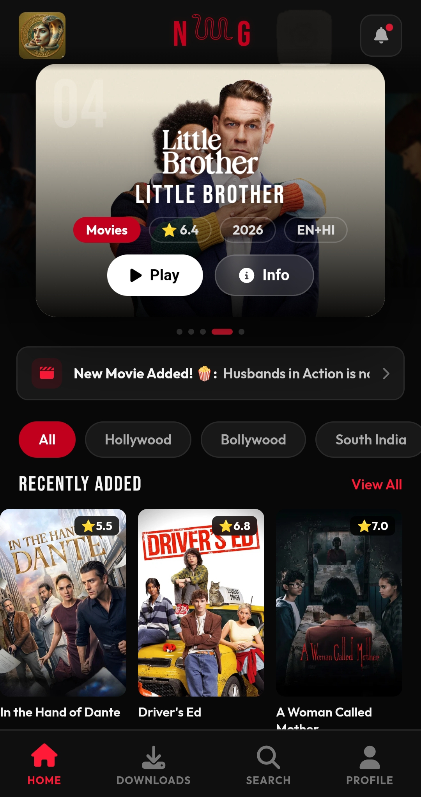
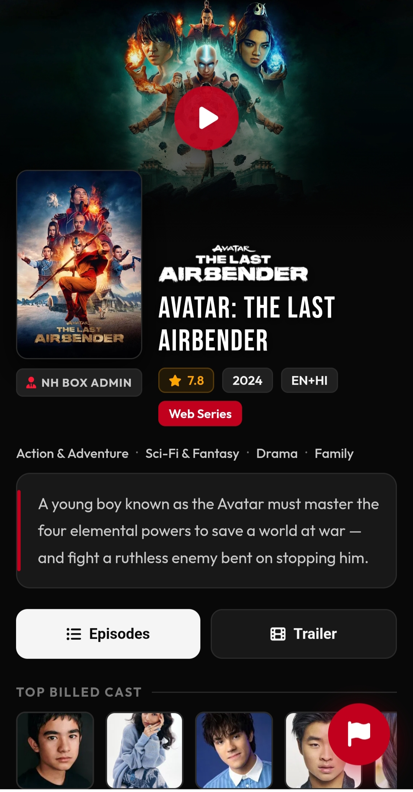
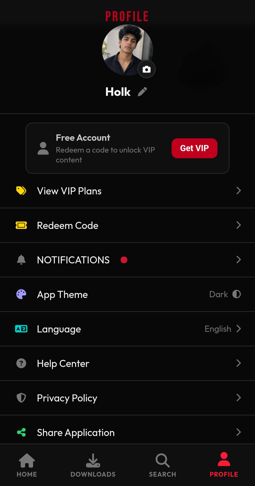

# N𓆙G Series

### Your Entertainment, Anywhere, Anytime 🎬

---

## 📱 About

**N𓆙G Series** is a sleek, modern streaming app that brings movies and web series straight to your Android device. Browse, watch, and download your favorite content with a smooth, Netflix-style experience built for speed and simplicity.

---

## ✨ Features

- 🎥 **Stream Movies & Web Series** — A growing library of content, organized and easy to browse
- ⬇️ **Offline Downloads** — Save your favorite titles and watch without an internet connection
- 🔔 **Real-Time Notifications** — Get notified instantly when new content drops
- 🔒 **App Lock** — Secure the app with your fingerprint, face unlock, or device PIN
- 🎬 **Smooth Video Player** — Gesture controls, screen lock while watching, picture-in-picture, playback speed control, and more
- 🌙 **Dark, Cinematic UI** — A clean interface designed for binge-watching
- ⚡ **Lightweight & Fast** — Built to run smoothly even on lower-end devices

---

## 📥 Installation

1. Go to the [**Releases**](../../releases/latest) page
2. Download the latest `.apk` file under **Assets**
3. On your Android device, open the downloaded file
4. If prompted by **Google Play Protect**, tap **"Scan app"** and allow the install to continue — this is a standard one-time check for apps installed outside the Play Store
5. Open the app and enjoy! 🍿

> ⚠️ You may need to enable **"Install from Unknown Sources"** for your browser or file manager in your device's Settings if this is your first time installing an app outside the Play Store.

---

## 🖥️ Requirements

| Requirement | Minimum |
|---|---|
| Android Version | 5.0 (Lollipop) or higher |
| Storage | ~50 MB free space (more for downloads) |
| Internet | Required for streaming, optional once downloaded |

---

## 📸 Screenshots

<!-- Add your app screenshots here -->
<!--    -->

*Screenshots coming soon*

---

## 🆘 Support & Feedback

Found a bug or have a suggestion? Open an [issue](../../issues) and let us know!

---

## 📄 License

This project's source and assets are proprietary. Unauthorized redistribution, modification, or resale is not permitted.

---

**Made with ❤️ for movie & series lovers**

